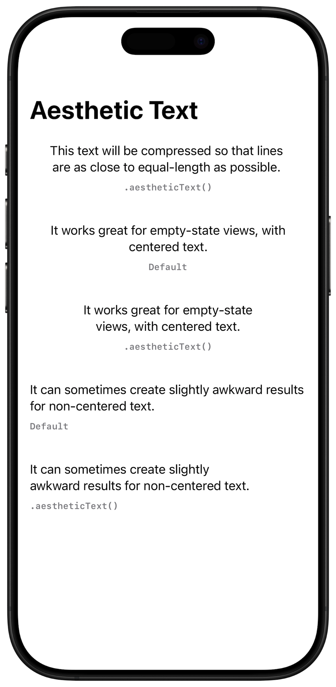

# AestheticText

A SwiftUI modifier that will compress `Text` horizontally as much as possible without wrapping to another line - that is, make each line as close in width as possible. For ✨aesthetics✨

### Installation and Usage

- File > Add Package Dependencies...
- Add `https://github.com/kylebshr/AestheticText.git`
- Select “Up to Next Major” with “1.0.0”

```swift
import AestheticText

Text(someAwesomeText)
    .aestheticText()
```

### Implementation

This is implemented using a single-view `Layout` that measures its content using a binary search to find the smallest possible width (with a tuned level of precison) that does not affect the height.

### Drawbacks

Since this implementation has no knowledge of the actual content of the Text being rendered, this comes with some drawbacks. For example, it may cause the second line of two lines of text to become longer than the first, since it results in a narrower width, which may actually look worse and be undesirable. For this reason, it works best with centered text, where this behavior doesn’t look off. This screenshot from the demo project illustrates the issue:


